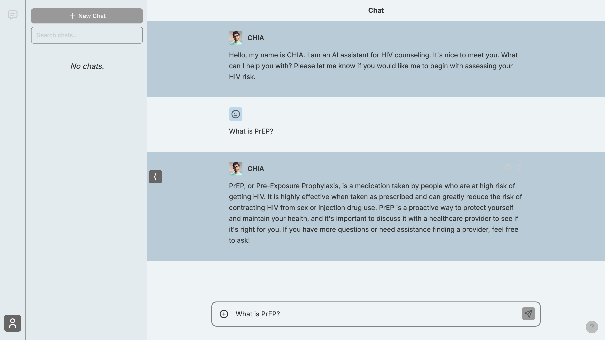

# Counseling Chatbot

A comprehensive HIV/PREP counseling chatbot application with a Next.js frontend and FastAPI backend, featuring AI-powered counseling agents and document retrieval capabilities.



## Features

- **AI-Powered Counseling**: Multiple specialized counseling agents for HIV/PREP guidance
- **Document Retrieval**: RAG (Retrieval-Augmented Generation) system for accessing relevant documents
- **Responsive UI**: Built with Next.js, React, and Tailwind CSS
- **Real-time Chat**: WebSocket-based communication between frontend and backend
- **Docker Support**: Easy deployment with Docker and Docker Compose

## Prerequisites

Before installing the application, ensure you have the following installed on your system:

- **Python 3.11** - Required for the backend
- **Node.js 18+** - Required for the frontend
- **npm** - Package manager for Node.js
- **Git** - For cloning the repository

## Installation

### 1. Clone the Repository

```bash
git clone <https://github.com/josuebusta/counseling-chatbot.git>
cd counseling-chatbot
```

### 2. Backend Setup

1. **Create and activate a Python virtual environment:**
   ```bash
   python3.11 -m venv counseling-env
   source counseling-env/bin/activate  # On Windows: counseling-env\Scripts\activate
   ```

2. **Install Python dependencies:**
   ```bash
   pip install -r requirements.txt
   ```

### 3. Frontend Setup

1. **Navigate to the frontend directory:**
   ```bash
   cd frontend
   ```

2. **Install Node.js dependencies:**
   ```bash
   npm install
   ```

3. **Return to the root directory:**
   ```bash
   cd ..
   ```

### 4. Environment Configuration

Create a `.env` file in the root directory with the following required variables:

```env
# Supabase Configuration
NEXT_PUBLIC_SUPABASE_URL=your_supabase_url
NEXT_PUBLIC_SUPABASE_ANON_KEY=your_supabase_anon_key

# OpenAI Configuration
OPENAI_API_KEY=your_openai_api_key

# Other API keys as needed
```

**Note**: The `.env` file is not included in the repository for security reasons. You'll need to create this file with your actual API keys.

## Running the Application

### Development Mode

#### Option 1: Using npm scripts (Recommended)

From the root directory:

```bash
# Start backend
npm run start-backend

# In a new terminal, start frontend
npm run start-frontend
```

#### Option 2: Manual startup

**Backend:**
```bash
# Activate virtual environment
source counseling-env/bin/activate  # On Windows: counseling-env\Scripts\activate

# Start the backend server
cd backend
uvicorn main:app --reload
```

**Frontend:**
```bash
cd frontend
npm run build
npm run start
```

### Production Mode with Docker

1. **Build and run with Docker Compose:**
   ```bash
   docker-compose up --build
   ```

2. **Access the application:**
   - Frontend: http://localhost:3000
   - Backend API: http://localhost:8000

## Application Structure

```
counseling-chatbot/
├── backend/                 # FastAPI backend
│   ├── agents/             # AI counseling agents
│   ├── tools/              # Utility functions
│   ├── data/               # Vector store and data
│   └── main.py             # FastAPI application entry point
├── frontend/               # Next.js frontend
│   ├── app/                # Next.js app directory
│   ├── components/         # React components
│   ├── lib/                # Utility libraries
│   └── types/              # TypeScript type definitions
├── docker-compose.yml      # Docker configuration
├── requirements.txt        # Python dependencies
└── package.json           # Node.js dependencies and scripts
```

## Development Notes

- **Backend changes**: The backend runs with `--reload` flag, so changes are reflected immediately
- **Frontend changes**: After making frontend changes, you need to rebuild and restart:
  ```bash
  cd frontend
  npm run build
  npm run start
  ```
- **Virtual environment**: Always activate the virtual environment before working with the backend
- **Environment variables**: Ensure all required environment variables are set in the `.env` file

## Troubleshooting

### Common Issues

1. **Port conflicts**: Ensure ports 3000 and 8000 are available
2. **Python version**: Make sure you're using Python 3.11 specifically
3. **Node.js version**: Ensure you have Node.js 18 or higher
4. **Missing dependencies**: Run `pip install -r requirements.txt` and `npm install` in the respective directories

### Getting Help

If you encounter issues:
1. Check that all prerequisites are installed
2. Verify that the `.env` file contains all required variables
3. Ensure all dependencies are installed correctly
4. Check the console output for specific error messages

## Security Notes

- Never commit the `.env` file to version control
- Keep your API keys secure and rotate them regularly
- The `chatbot-docker.pem` file is for deployment access only 

