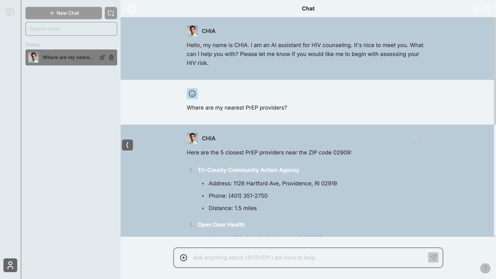

# CHIA - Chatbot for HIV Intervention & Action - Frontend

This directory contains CHIA's frontend implementation, organized into a modular architecture for better maintainability and separation of concerns.




## Directory Structure

```
frontend/
├── app/                        # Next.js app directory
│   ├── [locale]/              # Internationalization support
│   │   ├── chat/              # Chat interface pages
│   │   ├── providers/         # Provider search pages
│   │   ├── assessment/        # HIV risk assessment pages
│   │   ├── support/           # Support and help pages
│   │   ├── settings/          # User settings pages
│   │   ├── layout.tsx         # Root layout component
│   │   ├── page.tsx           # Home page
│   │   ├── globals.css        # Global styles
│   │   └── i18n.ts            # Internationalization config
│   ├── api/                   # API routes
│   │   ├── chat/              # Chat-related API endpoints
│   │   ├── providers/         # Provider search API
│   │   ├── assessment/        # Assessment API endpoints
│   │   └── websocket/         # WebSocket connection handling
│   └── auth/                  # Authentication pages
│       └── login/             # Login page
├── components/                # React components
│   ├── chat/                  # Chat interface components
│   │   ├── chat-interface.tsx # Main chat interface
│   │   ├── message-bubble.tsx # Individual message display
│   │   ├── chat-input.tsx     # Message input component
│   │   ├── agent-selector.tsx # Agent selection dropdown
│   │   └── chat-helpers/      # Chat utility components
│   ├── messages/              # Message display components
│   │   ├── message-list.tsx   # Message list container
│   │   ├── message-item.tsx   # Individual message item
│   │   └── typing-indicator.tsx # Typing animation
│   ├── models/                # Model selection components
│   │   ├── model-selector.tsx # Model selection dropdown
│   │   └── model-info.tsx     # Model information display
│   ├── setup/                 # Setup and configuration
│   │   ├── initial-setup.tsx  # Initial setup wizard
│   │   └── configuration.tsx  # Configuration panel
│   ├── sidebar/               # Sidebar navigation
│   │   ├── sidebar.tsx        # Main sidebar component
│   │   ├── chat-history.tsx   # Chat history list
│   │   └── navigation.tsx     # Navigation menu
│   ├── ui/                    # Reusable UI components
│   │   ├── button.tsx         # Button component
│   │   ├── input.tsx          # Input component
│   │   ├── modal.tsx          # Modal component
│   │   ├── dropdown.tsx       # Dropdown component
│   │   └── index.ts           # Component exports
│   └── utility/               # Utility components
│       ├── loading-spinner.tsx # Loading indicator
│       ├── error-boundary.tsx  # Error handling
│       └── toast.tsx          # Toast notifications
├── lib/                       # Utility libraries
│   ├── hooks/                 # Custom React hooks
│   │   ├── use-chat.ts        # Chat functionality hook
│   │   └── use-websocket.ts   # WebSocket connection hook
│   ├── models/                # Model configurations
│   │   ├── openai.ts          # OpenAI model configs
│   │   └── anthropic.ts       # Anthropic model configs
│   ├── retrieval/             # Document retrieval utilities
│   │   ├── vector-search.ts   # Vector search functionality
│   │   └── document-loader.ts # Document loading utilities
│   ├── server/                # Server-side utilities
│   │   ├── supabase.ts        # Supabase client
│   │   └── auth.ts            # Authentication utilities
│   └── utils.ts               # General utility functions
├── types/                     # TypeScript type definitions
│   ├── chat.ts                # Chat-related types
│   ├── models.ts              # Model configuration types
│   ├── providers.ts           # Provider search types
│   └── api.ts                 # API response types
├── db/                        # Database schemas and utilities
│   ├── chats.ts               # Chat data management
│   ├── messages.ts            # Message data management
│   ├── providers.ts           # Provider data management
│   └── storage/               # Local storage utilities
├── supabase/                  # Supabase configuration
│   ├── migrations/            # Database migrations
│   ├── functions/             # Edge functions
│   └── config.toml            # Supabase configuration
├── public/                    # Static assets
│   ├── locales/               # Internationalization files
│   ├── providers/             # Provider logos and images
│   └── icons/                 # Application icons
├── components.json            # UI component configuration
├── next.config.js             # Next.js configuration
├── tailwind.config.ts         # Tailwind CSS configuration
├── tsconfig.json              # TypeScript configuration
└── package.json               # Dependencies and scripts
```

## Core Components

### 1. App Directory (`app/`)
- **Layout System**: Root layout with internationalization support
- **Page Routing**: Next.js app router with locale-based routing
- **API Routes**: Server-side API endpoints for backend communication
- **Authentication**: Login and authentication pages

### 2. Components (`components/`)
- **Chat Interface**: Real-time chat components with WebSocket integration
- **Message System**: Message display, input, and management components
- **Model Selection**: AI model selection and configuration components
- **Setup & Configuration**: Initial setup and user configuration wizards
- **Sidebar Navigation**: Chat history, navigation, and user interface
- **UI Components**: Reusable UI components built with shadcn/ui
- **Utility Components**: Loading states, error handling, and notifications

### 3. Libraries (`lib/`)
- **Custom Hooks**: React hooks for chat, WebSocket, and state management
- **Model Configurations**: AI model settings and API configurations
- **Retrieval System**: Document search and vector retrieval utilities
- **Server Utilities**: Supabase client and authentication helpers
- **General Utils**: Common utility functions and helpers

### 4. Type System (`types/`)
- **Chat Types**: Message, conversation, and chat-related type definitions
- **Model Types**: AI model configuration and response types
- **Provider Types**: Healthcare provider search and data types
- **API Types**: Backend API request and response type definitions

### 5. Database (`db/`)
- **Data Management**: Supabase database schemas and data access
- **Storage Utilities**: Local storage and caching mechanisms
- **Data Models**: TypeScript interfaces for data structures

## Key Features

1. **Real-time Communication**: WebSocket integration for live chat functionality
2. **Internationalization**: Multi-language support with locale-based routing
3. **Responsive Design**: Mobile-compatible design with Tailwind CSS
4. **Type Safety**: Full TypeScript support with type checking
5. **Component Library**: UI components with shadcn/ui
6. **State Management**: Custom hooks for state management
7. **API Integration**: Seamless communication with FastAPI backend

## Usage

### Basic Setup

```typescript
// Using the chat interface
import { ChatInterface } from '@/components/chat/chat-interface'
import { useChat } from '@/lib/hooks/use-chat'

function ChatPage() {
  const { messages, sendMessage, isLoading } = useChat()
  
  return (
    <ChatInterface
      messages={messages}
      onSendMessage={sendMessage}
      isLoading={isLoading}
    />
  )
}
```

### Custom Hooks

```typescript
// Using WebSocket connection
import { useWebSocket } from '@/lib/hooks/use-websocket'

function ChatComponent() {
  const { socket, isConnected, sendMessage } = useWebSocket('ws://localhost:8000/ws')
  
  useEffect(() => {
    if (socket) {
      socket.onmessage = (event) => {
        const data = JSON.parse(event.data)
        // Handle incoming messages
      }
    }
  }, [socket])
}
```

### Component Integration

```typescript
// Using UI components
import { Button } from '@/components/ui/button'
import { Input } from '@/components/ui/input'
import { Modal } from '@/components/ui/modal'

function ProviderSearch() {
  return (
    <Modal>
      <Input placeholder="Search providers..." />
      <Button>Search</Button>
    </Modal>
  )
}
```

## Module Dependencies

```
app/[locale]/chat/page.tsx
├── components/
│   ├── chat/
│   │   ├── chat-interface.tsx
│   │   ├── message-bubble.tsx
│   │   └── chat-input.tsx
│   ├── messages/
│   │   ├── message-list.tsx
│   │   └── message-item.tsx
│   └── ui/
│       ├── button.tsx
│       └── input.tsx
├── lib/
│   ├── hooks/
│   │   ├── use-chat.ts
│   │   └── use-websocket.ts
│   └── utils.ts
└── types/
    ├── chat.ts
    └── api.ts
```

## Development

### Prerequisites

- **Node.js 18+** - Required for the frontend
- **npm** - Package manager for Node.js
- **Backend running** - The FastAPI backend must be running for full functionality

### Installation

```bash
# Install dependencies
cd frontend
npm install

# Set up environment variables
cp .env.local.example .env.local
# Edit .env.local with your configuration
```

### Running the Frontend

```bash
# Development mode
npm run dev

# Production build
npm run build
npm run start

# From root directory
npm run frontend
```

### Environment Configuration

The frontend uses environment variables from the root `.env` file:

```env
# Supabase Configuration
NEXT_PUBLIC_SUPABASE_URL=your_supabase_url
NEXT_PUBLIC_SUPABASE_ANON_KEY=your_supabase_anon_key
SUPABASE_SERVICE_ROLE_KEY=your_supabase_service_role_key

# OpenAI Configuration
OPENAI_API_KEY=your_openai_api_key
```

### Docker

```bash
# Build the Docker image
docker build -f Dockerfile.frontend -t counseling-frontend .

# Run the container
docker run -p 3000:3000 counseling-frontend
```

## Architecture Benefits

1. **Separation of Concerns**: Each component category has a specific responsibility
2. **Maintainability**: Easier to locate and modify specific functionality
3. **Testability**: Individual components can be tested in isolation
4. **Reusability**: UI components can be reused across different pages
5. **Readability**: Smaller, focused files are easier to understand
6. **Scalability**: Modular design allows for easy extension and modification
7. **Type Safety**: Full TypeScript support prevents runtime errors
8. **Performance**: Optimized with Next.js features like code splitting and SSR

## Migration Notes

The frontend has been structured for optimal maintainability and scalability:
- Components organized by functionality and reusability
- Custom hooks for complex state management
- Type definitions centralized in types/ directory
- UI components built with shadcn/ui for consistency
- Internationalization support built-in
- WebSocket integration for real-time communication
